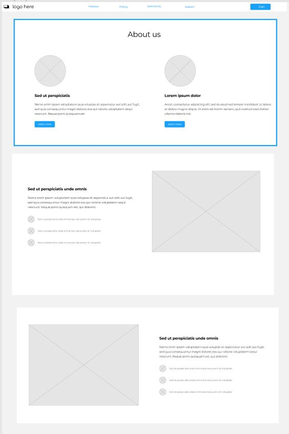

# Project Planning
For this assignment, you'll create some initial plans for your project.

## Assignment Description
[Project Planning Assignment](https://education.launchcode.org/liftoff/modules/assignments/project-planning)

## Submission Instructions

### Wireframes

Include at least 3 wireframes here, adding images or files to your repository as necessary. Format them as a bulleted/unordered list with links to the files.

- See [homepage](https://github.com/raissahavens/liftoff-assignments/blob/master/P3-Project_Planning/img/homepage.png)
- (https://github.com/raissahavens/liftoff-assignments/blob/master/P3-Project_Planning/img/products.png)
- (https://github.com/raissahavens/liftoff-assignments/blob/master/P3-Project_Planning/img/cart.png)
- (https://github.com/raissahavens/liftoff-assignments/blob/master/P3-Project_Planning/img/contactForm.png)

Include a link to your public Trello board. Be sure you have user stories added for at least your first 2-week sprint.

&rarr; https://trello.com/b/760zjjAs/liftoff-project-launchcode

Include a link to your project on GitHub.

&rarr; https://github.com/raissahavens/docsbagels

